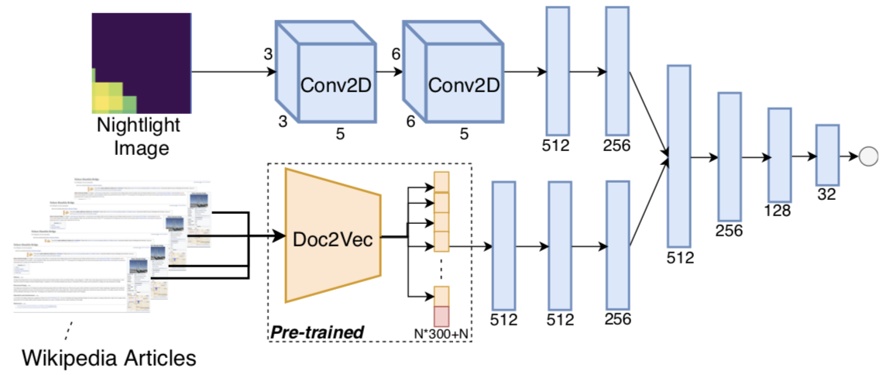
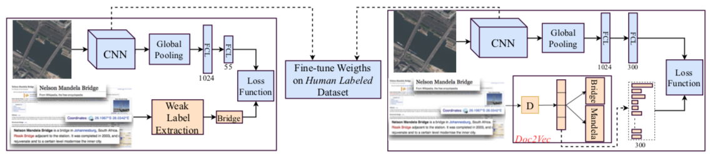


- I gave a seminar at Sabanci University, Turkey.[Abstract](https://mfg.sabanciuniv.edu/tr/events-detail/21371) [PDF](../files/Sabanci_Seminar.pdf)

- Our paper on `Removing Cloud from Satellite Images Using Spatiotemporal Generator Networks` is accepted to WACV 2020 Conference.[arxiv](https://arxiv.org/pdf/1912.06838.pdf)

- Our paper on `Efficient Object Detection in Large Images using Deep Reinforcement Learning` is accepted to WACV 2020 Conference.[arxiv](https://arxiv.org/pdf/1912.03966.pdf)

- I presented one of my recent research projects in University of California at San Diego.

- We have submitted one paper on `Dynamic Data Sampling using Deep Reinforcement Learning` to CVPR 2020.[RGATE](https://www.researchgate.net/publication/336778211_Learning_When_and_Where_to_Zoom_With_Deep_Reinforcement_Learning)

- We have submitted one paper on `Adversarial Domain Adaptation for Improving Deep Convolutional Neural Network's Performance on Low Resolution Images` to AAAI 2020.

- We have submitted one paper on `Efficient Object Detection on Large Images using Deep Reinforcement Learning` to WACV 2020.

- We have submitted one paper on `Cloud Removal from Satellite Images Using Spatiotemporal GANs` to WACV2020.

- Five papers reviewed for the NeurIPS 2019.

- Our Paper on `Large-Scale Unsupervised Pre-training of CNNs with Image to Text Matching` is accepted to IJCAI 2019 conference! [arxiv](https://arxiv.org/pdf/1905.02506.pdf) [code](https://github.com/buzkent86/WikiSatNet)

- Our paper on `Predicting Economic Development using Wikipedia Articles` is accepted to KDD 2019 conference! [arxiv](https://arxiv.org/pdf/1905.01627.pdf) [code](https://github.com/buzkent86/WikipediaPovertyMapping)

- I have given a seminar at Orbital Insight.

- We have submitted our work on `Predicting Economic Development using Textual Information` to the KDD 2019 conference.
	

- We have submitted our work on `Large Scale Pre-training Using Weakly Supervised and Unsupervised Learning on Overhead Images` to the IJCAI 2019 conference. [arxiv](https://arxiv.org/abs/1809.10236)
	

- Our paper on `Deep Hyperspectral Kernelized Correlation Filter (DeepHKCF) Tracking in Aerial Images` is accepted to the IEEE Transactions on Geoscience and Remote Sensing. [arxiv](https://arxiv.org/abs/1711.07235) [code](https://github.com/buzkent86/HKCF_Tracker)
	

- I have presented my recent works on object detection and tracking in aerial images in the Vision and Autonomous System Center Seminar at Carnegie Mellon University.[Abstract](https://www.ri.cmu.edu/event/object-detection-and-tracking-on-low-resolution-aerial-images/)

- I presented our paper on high-speed scale adaptive object tracking in WACV18 conference in South Lake Tahoe. [Presentation](../files/WACV18_Presentation.pdf) [Poster](../files/WACV18_Poster.pdf) [Video](https://www.youtube.com/watch?v=xLjLc0eVqLU)

- Our paper on high-speed scale-adaptive object tracking (>300fps) is accepted to the *IEEE Winter Conference on Applications ofa Computer Vision (WACV18) 2018*. [arxiv](https://arxiv.org/pdf/1801.06729.pdf) [code](https://github.com/buzkent86/EnKCF_Tracker)

  - [Demo Video 1](https://www.youtube.com/embed/dWeIbECiVkY?ecver=1), [Demo Video 2](https://www.youtube.com/embed/ZCnAjxJkseY?ecver=1), [Demo Video 3](https://www.youtube.com/embed/hAxA903YH2Y?ecver=1), [Demo Video 4](https://www.youtube.com/embed/h-yXx1A2dL0?ecver=1)

  

- We submitted our paper on high speed object tracking to the *Winter Application of Computer Vision Conference 2018*. Some experiments on the UAV123 dataset is attached below. The experiments are carried out on an *I5, 2.7 GHz processor* in *C++* platform on a Ubuntu OS. We propose a scale adaptive-tracker that can run on average at `416 fps` on the *UAV123 dataset*, that is faster than the vanilla form KCF tracker operating at `380 fps` in the same platform on the *UAV123 dataset*. Such tracker can then be run on a low-end platform at real-time (`30 fps`) unlike most of the state-of-the-art trackers. All the KCF driven trackers handle the scale update in a computationally demanding way, reducing the run-time performance from multiple hundreds of fps to less than a hunder fps. On the other hand, the proposed scale-adaptive tracker is as efficient as original KCF tracker, running at even slightly higher speed than the original KCF on the *UAV123 dataset*.

	- Uzkent, Burak, and Seo, YoungWoo "EnKCF : Ensemble of Kernelized Correlation Filters for Object Tracking in High Speed" [Abstract](abstract_wacv18.pdf)

- Our paper is accepted to the *Perception Beyond the Visible Spectrum Workshop in conjunction with the Computer Vision and Pattern Recognition Conference 2017*

	- Uzkent, Burak, Aneesh Rangnekar, Matthew J. Hoffman, and Anthony Vodacek. "Aerial Vehicle Tracking by Adaptive Fusion of Hyperspectral Likelihoods Maps"

	

- Our [Hyperspectral Aerial Video Set](https://buzkent86.github.io/datasets/) for vehicle tracking is uploaded. Please cite the paper listed below if you use this dataset in your research. Our dataset also contains the ground truth files of the vehicles in the scene. You can download the C detection module coupled to MATLAB tracking module in this [link](https://github.com/buzkent86/CVPRW17_Paper_Code).

	- Uzkent, Burak, Matthew J. Hoffman, and Anthony Vodacek. "Real-Time Vehicle Tracking in Aerial Video Using Hyperspectral Features." In *Proceedings of the IEEE Conference on Computer Vision and Pattern Recognition Workshops*, pp. 36-44. 2016.

	

- I defended my Ph.D. thesis on "Aerial Vehicle Tracking using a Multi-modal Optical Sensor" as of May 16, 2016. I would like to thank my thesis committee and my advisor Dr. Hoffman and co-adviser Dr. Vodacek for their supervision throughout my Ph.D. [Presentation](../files/Thesis.Defense.pdf)

- I finished my internship at *Huawei R&D* where I worked on representing people with face-only and contextual features to classify individuals in a photo album as strangers and family members. The second part of my work included designing an album-specific classifier to assign sematic roles to family members. My work also includes designing a general conditional random field graph based approach where several attributes about the individuals, and pairs are utilized to assign semantic roles. You can find an experiment on a family picture with strangers in the figure below. To learn contextual features, the ZFNet (Improved AlexNet) is fine-tuned on the People in Photo Album Dataset on three different areas including context. You can find the Caffe fine-tuning prototxt files in this [link](https://github.com/buzkent86/AlexNet_FineTuned_PersonRecognition). For the face-only area, the pre-trained *FaceNet* model, an end-to-end face verification model, is used.

	

- Our journal paper titled "Integrating Hyperspectral Likelihoods in a Multi-dimensional Assignment Algorithm for Aerial Vehicle Tracking" is accepted by the *IEEE Journal of Selected Topics in Remote Sensing and Observation*. In this [link](https://www.youtube.com/watch?v=scRQjEMGSRE), you can find an example of single target tracking from a fixed aerial platform.

- For short term (2014 Summer), I worked on *3-D Cardiac segmentation using MRI slices*. I presented our paper in the IEEE Western New York Image Processing Workshop. Below, you can visualize some results on canine (left) and sheep (right) heart segmentation. C++ implementation can be found in this [link](https://github.com/buzkent86/3D_MRI_Segmentation).

	- Uzkent, Burak, Matthew J. Hoffman, Elizabeth Cherry, and Nathan Cahill. "3-D MRI cardiac segmentation using graph cuts." In *Image and Signal Processing Workshop (WNYISPW)*, 2014 IEEE Western New York, pp. 47-51. IEEE, 2014.

	Canine Heart             |  Sheep Heart
	:-------------------------:|:-------------------------:
	  |  
